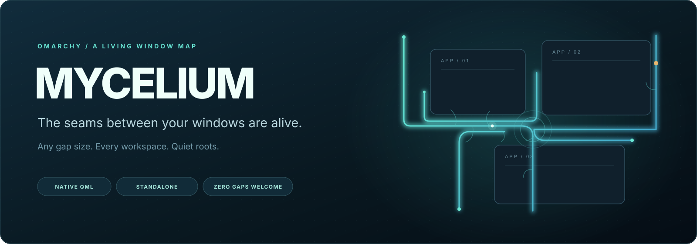
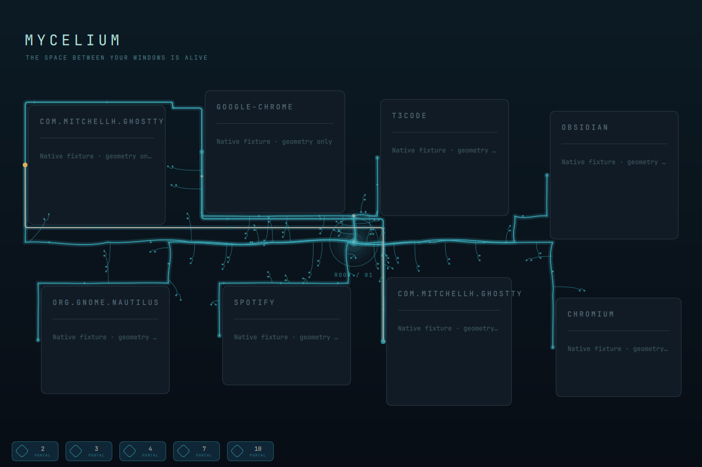
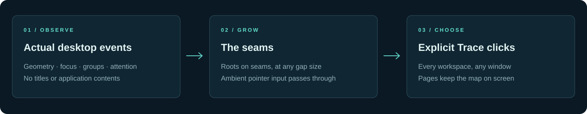
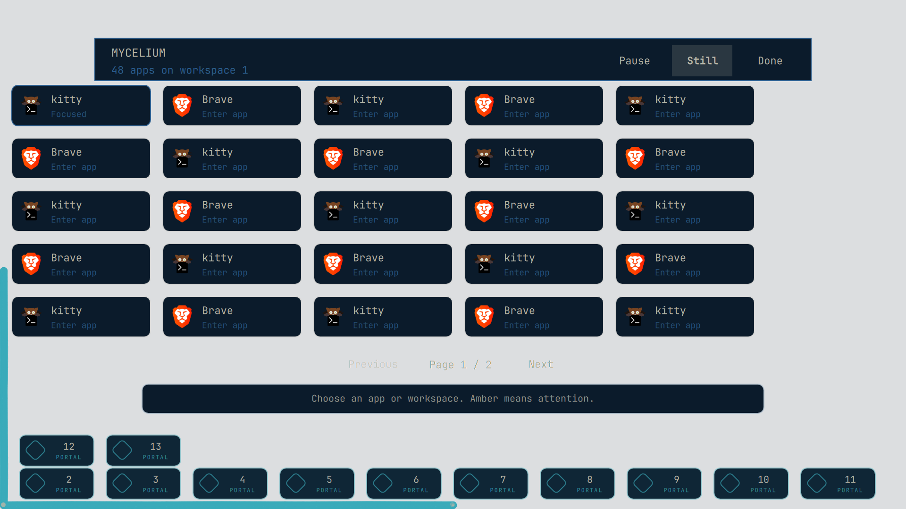
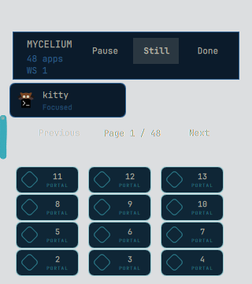
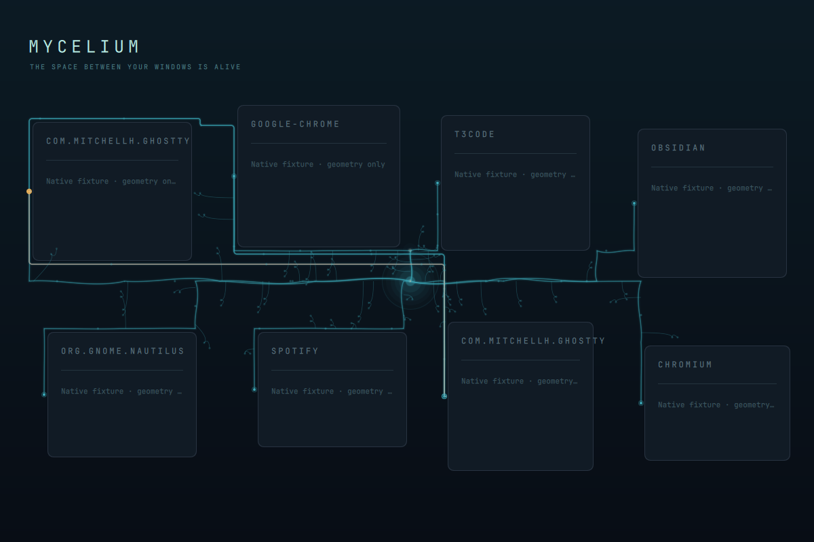

# Mycelium



**A living window map for your Omarchy desktop.** Mycelium grows quiet roots in the gaps around your windows. Switch apps and a short focus pulse travels through an observed connection. Open, close or move a window and the roots reshape themselves. Open **Trace** when you want to see the map and enter an app or workspace.

It is a standalone native QML plugin for **Omarchy Quattro + Hyprland**. There is no Infomarchy dependency or adapter. Colors follow your Omarchy theme.

The screenshots below are the actual native v3 renderer with invented geometry and app metadata. They contain no real application contents or identifying desktop data. The banner and flow diagram are original SVG artwork. **Version 0.3.0 is tested and ready; activation on the development desktop is still pending.**

## Install

You need an existing Omarchy Quattro desktop, Hyprland, Quickshell, Python 3, Git and the Omarchy plugin CLI. Run as your normal desktop user:

```bash
omarchy plugin add https://github.com/nixfred/omarchy-mycelium.git --enable
```

Follow Omarchy's review and installation prompts. A branching stem appears in the right section of the bar. Its left click opens Trace; its right click toggles Pause. For future Git-managed updates:

```bash
omarchy plugin update nixfred.mycelium
```

Already have a manually copied Mycelium installation? Use the [existing-installation guide](docs/INSTALL.md#existing-manual-installation) to preserve your layout. Omarchy's Git `add` command refuses an occupied destination.

## Read the space between your windows



Roots follow available negative space around actual window rectangles. A structural root is visual structure. A focus link records an observed switch between live windows. A group link reflects a compositor window group. A pulse shows a recent focus change; amber means attention.

Those connections do not claim that applications exchanged content or communicated with each other. Mycelium does not read window titles, pixels inside applications, audio or clipboard data.



## Find your way with Trace

Left-click the bar stem, choose an app card or a workspace portal, and Trace closes as that explicit action enters the target. Keyboard focus stays with your application while the map is open. **Done** or empty background dismisses Trace.

| Control | Result |
| --- | --- |
| Bar stem: left click | Open Trace |
| Bar stem: right click | Pause or resume ambient roots |
| App card / workspace portal | Enter that live app or workspace |
| Previous / Next | Change the app-card page |
| Pause / Resume | Hide or restore ambient roots |
| Still | Keep eligible roots visible without animation |
| Done / blank background | Close Trace |
| Retry, when disconnected | Ask for a fresh desktop connection |

## Cards fit the screen

When spatial labels would collide, Trace uses bounded app pages instead of scrolling. Previous, Next and page counts stay visible at normal text size. It reaches all 48 windows supported by the bridge. Live closures and resizes clamp the selected page; reopening Trace or changing workspace starts at page one.



The compact view was checked down to 320×360 logical pixels. At that size, one app card fits per page while the workspace controls remain accessible. On an even smaller output, Trace can report that more room is needed rather than place cards over its controls.

<p align="center"></p>

## Quiet when you need it



Ambient roots pass pointer input through to your desktop. True fullscreen, an off output, Pause, or an unavailable connection suppress eligible drawing and animation. Still disables motion. Geometry probes are capped at 2 Hz while the service is active and a visible output is eligible, with idle polling at zero. Ordinary desktop changes arrive through compositor events.

Only visual seeds and the Pause/Still booleans persist locally. No focus history is written to disk. See [privacy, bounds and verification](docs/VERIFICATION.md).

## Known limits

- Tiny or completely occupied gaps can leave no room for roots; Trace's app cards can still be useful.
- The bridge accepts up to 48 windows. The bounded visual topology uses up to 24 root nodes, 32 observed links and 64 paths. Trace shows up to twelve other workspace portals.
- App identity comes from desktop entries and app classes, so multiple windows of the same app can share a label. Icons fall back when an entry is unavailable.
- Native tests use synthetic fixtures. The development desktop currently runs the earlier v2; a live v3 activation result is not claimed here.

## Develop and verify

The plugin runtime is `manifest.json`, `bridge.py` and the five files in `v3/`. The portable test suite exercises the actual bridge and geometry, not a duplicate implementation. [Development guide](docs/DEVELOPMENT.md) · [review decisions and validation](docs/VERIFICATION.md).

```bash
python3 tools/verify-runtime.py
python3 -m unittest discover -s tests -p 'test_*.py'
node tests/test_topology.js
node tests/test_tiled.js
node tests/test_resources.js
```

MIT © 2026 Fred Nix. Application names and icons shown in native fixtures belong to their respective projects.
