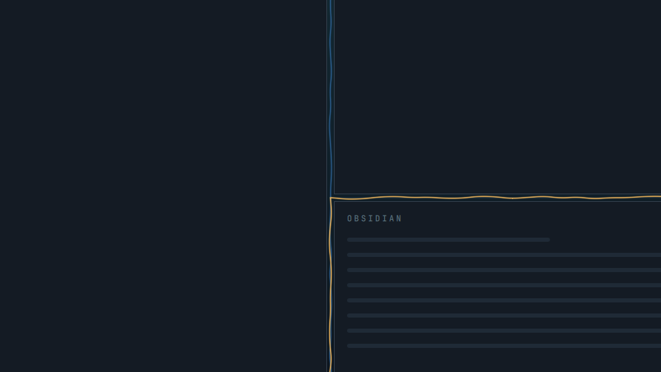
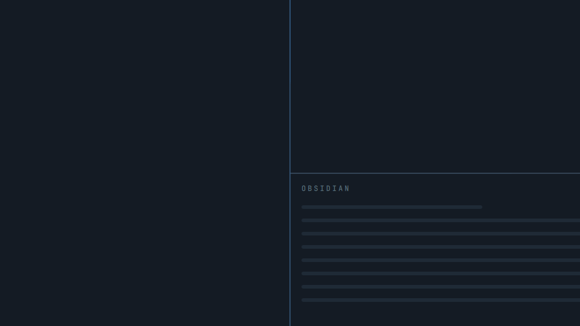

# Mycelium


**A living window map for your Omarchy desktop.** Quiet roots grow along the seams where your tiled windows meet, at any gap size, including none. Switch windows and a root grows around the one you picked. When an app needs you, its seams turn amber. Open **Trace** to see every workspace at once and jump straight to any window.

It is a standalone native QML plugin for **Omarchy Quattro + Hyprland**. There is no Infomarchy dependency, and colors follow your Omarchy theme.

## Why seams

Version 0.3 grew roots in the empty space between windows. Real tiling layouts barely have any: a common setup leaves 9 px at the screen edge and 12 px between windows, many people run zero gaps, and one window per workspace leaves only the outer margin. In those layouts nothing visible was drawn.

Every tiled layout has **seams**, though: the lines where windows meet each other and the screen edge. Version 0.4 puts each window side's root in the middle of whatever space that side faces, so neighbouring roots meet on the same line. With gaps, the root sits in the gap and can wave a little. With no gaps, it is a clean line on the shared border.





The pixel tests render real tiling geometry (zero gaps, 9/12 px gaps, one window and a floating window) and require that **not a single pixel inside a window changes** while thousands of seam pixels do.

## What the roots tell you

| You see | It means |
| --- | --- |
| Faint seams across the workspace | Your current layout |
| A root growing around a window | Focus just moved there; it grows from the side facing the window you left |
| A spark running along the seams | Focus jumped between windows that do not touch |
| Amber seams, one slowly pulsing | A window wants attention; only one thing on screen ever pulses |
| Seams fading and growing back | The layout changed or the workspace switched; roots wait for windows to settle |

Motion only answers an event and stops within about a second. **Still** keeps the roots without any animation. Floating windows and an open scratchpad cover the roots, and nothing is ever drawn across them.

## Install

You need an existing Omarchy Quattro desktop, Hyprland, Quickshell, Python 3, Git and the Omarchy plugin CLI. Run as your normal desktop user:

```bash
omarchy plugin add https://github.com/nixfred/omarchy-mycelium.git --enable
```

Follow Omarchy's review and installation prompts. A branching stem appears in the right section of the bar. Left-click it to open Trace; right-click to pause or resume. Its dot turns amber when any workspace has a window that wants attention. Update later with:

```bash
omarchy plugin update nixfred.mycelium
```

Already have a manually copied Mycelium? See the [existing-installation guide](docs/INSTALL.md#existing-manual-installation).

## Trace: every workspace at a glance


Trace draws every workspace as a miniature of its monitor, with each window in place and labelled by its app icon and name. The workspace you are on is highlighted, the focused window is outlined and urgent windows are amber. The gutters between tiles are seams too: bright roots along them link the workspaces you moved between recently.

| Control | Result |
| --- | --- |
| Bar stem: left click | Open Trace |
| Bar stem: right click | Pause or resume ambient roots |
| A window in a tile | Jump straight to that window, on any workspace |
| A workspace tile | Switch to that workspace |
| Previous / Next | Change page when the tiles do not fit |
| Pause / Still / Done | Hide roots, stop motion, or close Trace |
| Blank background | Close Trace |

Keyboard focus stays with your application while Trace is open. To bind a key, call `omarchy-shell nixfred.mycelium trace`.

<p align="center"></p>

When tiles would get too small, Trace pages instead of scrolling. It was checked down to 320×360 logical pixels, where two tiles fit per page.

## Privacy and limits

Mycelium reads window rectangles, app classes, workspace and monitor layout, focus, urgency and fullscreen state. It never reads window titles, pixels inside applications, audio or the clipboard. Only random visual seeds and the Pause and Still settings are saved. Workspace hops live in memory and are never written to disk. Ambient roots pass all pointer input through to your desktop. Geometry probes run at most twice a second, and only while you are active.

- With both gaps **and** borders set to 0 there is no space between windows at all. Seams then sit on the shared edge and overlap the outermost pixel of each window.
- Roots are drawn for up to 24 tiled windows per output; windows past that bound cover the roots instead. The bridge accepts 48 windows and 24 workspaces.
- Hyprland reports no event while you drag-resize a window. The roots hide on the next geometry probe and grow back when the layout settles, so for up to half a second a seam can trail a moving edge.
- App labels come from desktop entries and window classes, so several windows of one app share a label.

See [verification](docs/VERIFICATION.md) and the [requirements](docs/REQUIREMENTS.md).

## Develop and verify

The runtime is `manifest.json`, `bridge.py` and the five files in `v4/`. The test suite exercises the real bridge, geometry and QML, not a copy of them. [Development guide](docs/DEVELOPMENT.md).

```bash
python3 tools/verify-runtime.py
python3 -m unittest discover -s tests -p 'test_*.py'
node tests/test_topology.js
node tests/test_tiled.js
node tests/test_resources.js
```

MIT © 2026 Fred Nix. Application names and icons shown in native fixtures belong to their respective projects.
